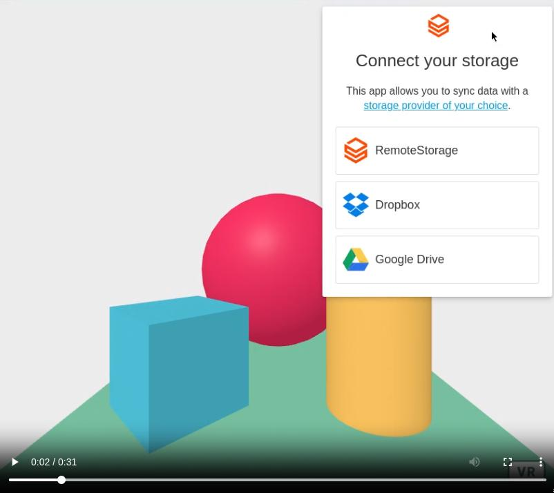

# remoteStorage

An open protocol for per-user storage on the Web

> Webfinger + OAuth + CORS + REST

Read more [on the protocol](https://remotestorage.io/) and [its apps](https://remotestorage.io/apps.html#apps)

> Check the [online demo here](https://coderofsalvation.codeberg.page/aframe-remotestorage/)

[](README.mp4)

## Installation

```
    <script src="https://aframe.io/releases/1.6.0/aframe.min.js"></script>
    <script src="build/aframe-remotestorage.min.js"></script> 
    <style type="text/css">
      #remotestorage-widget {
        z-index: 21000000;
        position: fixed;
        top: 0;
        right: 0;
      }
    </style>
  </head>
  <body>
    <a-scene remotestorage="dropbox: apikey; googledrive: apikey; logging: true; folder: myapp">

       ... see index.html for usage ...

    </a-scene>
  </body>
</html>


```

> See [index.html](index.html) as an example, which demonstrates a [store.js](store.js) component which uses the [aframe-remotestorage](build/aframe-remotestorage.js) AFRAME component.

## Where is the data stored?

* websites supporting [remotestorage protocol](https://remotestorage.io):
  * 5apps
* dropbox (adapter)
* gdrive (adapter)


## Demo explanation 

1. for storage get an account on [5apps.com](5apps.com), dropbox, gdrive or **ideally** selfhost [armadietto](https://github.com/remotestorage/armadietto)
2. open the [online demo](https://coderofsalvation.codeberg.page/aframe-remotestorage/)
3. click the 'connect storage'-widget
4. enter your account address 

> Once you're connected try modifying the scene:

5. launch the AFRAME designer by pressing 'editor'-button (or ctrl+shift+i) 
6. modify some objects
7. optional: run `$('a-sphere').setAttribute("scale","0.2 0.2 0.2")`
8. now reload the page

> Profit! the scene is now saved/loaded to/from your storage.

9. verify whether a `myapp`-folder was written to your storage

## Where can I view/edit the data?

Simple! With other webapps which support remotestorage :)

* [remotestorage-browser](https://remotestorage-browser.5apps.com)
* [inspektor](https://inspektor.5apps.com/)
* [more apps](https://remotestorage.io/apps.html#apps)

## Developer docs

Developers can use/access the `remoteStorage`-object (initialized in the [aframe-remotestorage.js](index.js) component).<br>
Then, they can do various operations (demonstrated in `load()` and `save()` of [store.js](store.js)) which are documented here:

* https://remotestorage.io/rs.js/docs/api/baseclient/classes/BaseClient.html 
